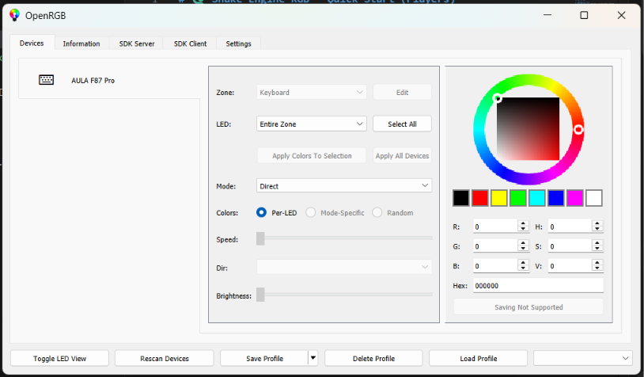
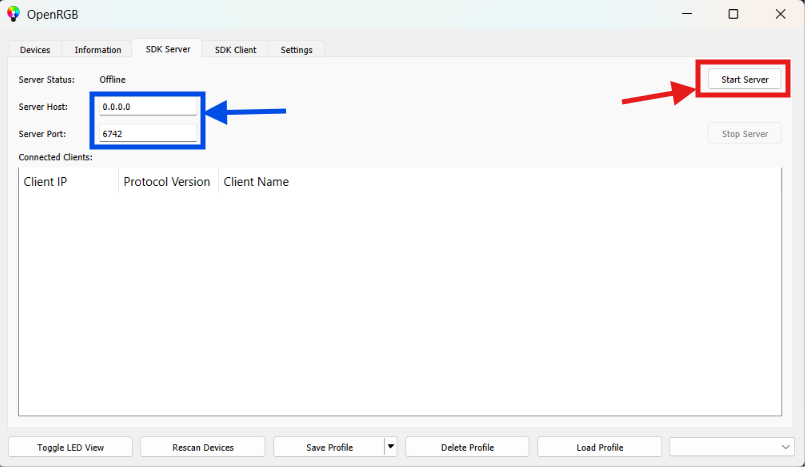

# 🐍 Snake Engine RGB

**Play Snake on your RGB keyboard.** The game renders the snake and food directly onto your keyboard LEDs using [OpenRGB](https://openrgb.org).

| Snake (Red) | Food (Green) | Speed increases as you eat |
|:-----------:|:------------:|:--------------------------:|
| 🔴 | 🟢 | ⚡ |

---

## 📋 Table of Contents

- [Just Want to Play?](#-just-want-to-play)
- [For Developers](#-for-developers)
- [Starting the OpenRGB Server](#-starting-the-openrgb-server)
- [Controls](#-controls)
- [Architecture](#-architecture)
- [Safety & CPU/HID Analysis](#-safety--cpuhid-analysis)
- [Troubleshooting](#-troubleshooting)
- [Contributing](#-contributing)
- [License](#-license)

---

## 🎮 Just Want to Play?

Head to the **[`dist/`](./dist/)** folder — it contains:

| File | What it is |
|------|-----------|
| `snake_game.exe` | The game binary (statically linked, no extra DLLs needed) |
| `README.md` | Quick-start guide for players |

### Quick Start

1. **Install [OpenRGB](https://openrgb.org/releases.html)** (free, open source).
2. **Start the OpenRGB SDK server** (see [detailed steps below](#-starting-the-openrgb-server)).
3. **Run `dist/snake_game.exe`**.
4. **Use arrow keys** to play!

> **Note:** If you get a DLL error, make sure you're running the exe from inside the `dist/` folder, not from elsewhere.

---

## 🔧 For Developers

### Prerequisites

| Tool | Version | Install |
|------|---------|---------|
| Windows | 10 / 11 | — |
| MSYS2 (UCRT64) | Latest | [msys2.org](https://www.msys2.org) |
| g++ | 13+ | `pacman -S mingw-w64-ucrt-x86_64-gcc` |
| Git | Latest | [git-scm.com](https://git-scm.com) |
| OpenRGB | 0.9+ | [openrgb.org](https://openrgb.org/releases.html) |

### Clone

```bash
git clone --recurse-submodules https://github.com/YOUR_USERNAME/snake-engine-rgb.git
cd snake-engine-rgb
```

If you forgot `--recurse-submodules`:

```bash
git submodule update --init --recursive
```

### Build

**Option A — PowerShell script (recommended):**

```powershell
.\scripts\build.ps1
```

**Option B — VS Code:**

Press `Ctrl+Shift+B` → select **"Build Snake Engine"**.

**Option C — Manual:**

```bash
g++ -I OpenRGB-cppSDK/include -I OpenRGB-cppSDK/external \
    -I OpenRGB-cppSDK/external/CppUtils-Essential \
    -I OpenRGB-cppSDK/external/CppUtils-Network \
    -I src -g \
    src/main.cpp src/game.cpp src/server.cpp src/input.cpp \
    OpenRGB-cppSDK/src/*.cpp \
    OpenRGB-cppSDK/external/CppUtils-Essential/*.cpp \
    OpenRGB-cppSDK/external/CppUtils-Network/*.cpp \
    -o dist/snake_game.exe \
    -static-libgcc -static-libstdc++ -static -lws2_32
```

### Run

1. Start the OpenRGB SDK server.
2. Run `dist\snake_game.exe`.

---

## 🖥️ Starting the OpenRGB Server

The game communicates with your keyboard through OpenRGB's SDK server over a local TCP connection.

### Step 1 — Verify Your Keyboard is Detected

Open **OpenRGB** and go to the **Devices** tab. Your keyboard should appear in the left panel:



If your keyboard doesn't show up, click **Rescan Devices**. If it still doesn't appear, your keyboard may not be supported — check the [supported devices list](https://openrgb.org/devices_0.9.html?search=).

### Step 2 — Start the SDK Server

1. Click the **SDK Server** tab.
2. Make sure the **Server Host** is set to `0.0.0.0` and the **Server Port** is `6742`.
3. Click **Start Server**.



> [!IMPORTANT]
> If your **Server Host** or **Server Port** shows a different value than what's shown above, change it to **Host: `0.0.0.0`** and **Port: `6742`**. The game connects to `127.0.0.1:6742` by default and won't work with a different address.

### Verify It's Running

The game will print this on successful connection:

```
Connected to OpenRGB server at 127.0.0.1:6742
Found keyboard: Your Keyboard Name (22x6 matrix, 110 LEDs)
```

If it fails:

```
Failed to connect to OpenRGB Server: ConnectFailed
```

→ Go back to OpenRGB and make sure the server is started.

### Command-Line Start (Advanced)

You can also start OpenRGB with the server enabled from the command line:

```bash
OpenRGB.exe --server --server-port 6742
```

---

## 🎯 Controls

| Key | Action |
|-----|--------|
| `↑` Up Arrow | Move up |
| `↓` Down Arrow | Move down |
| `←` Left Arrow | Move left |
| `→` Right Arrow | Move right |

- 🔴 **Red** = Snake body
- 🟢 **Green** = Food
- The snake wraps around keyboard edges
- Speed increases with each food eaten
- Game ends on self-collision

---

## 🏗️ Architecture

The codebase is modular — each concern is in its own file:

```
src/
├── main.cpp      Entry point — wires server, game, and input together
├── game.h/cpp    Snake game logic (state, movement, collision, food)
├── server.h/cpp  OpenRGB connection & LED rendering (RGBServer class)
└── input.h/cpp   Keyboard input with high-frequency polling
```

### Why Separate Files?

| Module | Responsibility | Dependencies |
|--------|---------------|--------------|
| `game` | Pure game logic — positions, directions, collisions | Only `orgb::Zone` for matrix queries |
| `server` | All OpenRGB interaction — connect, discover, render | `orgb::Client`, `game.h` |
| `input` | Win32 keyboard polling | `windows.h`, `game.h` |
| `main` | Glue code | All of the above |

This separation makes it easy to:
- **Add features** without touching unrelated code
- **Port input** to Linux/macOS without changing game logic
- **Test game logic** independently of hardware

---

## 🛡️ Safety & CPU/HID Analysis

**This game is completely safe for your hardware.**

| Concern | Status | Explanation |
|---------|--------|-------------|
| Direct HID access | ❌ **None** | Uses `GetAsyncKeyState()` — a standard Win32 API. Does not open HID handles. |
| USB device access | ❌ **None** | Does not use `SetupDi*`, `HidD_*`, or any USB APIs. |
| OpenRGB interaction | ✅ **TCP only** | Sends color packets over localhost TCP (port 6742) to the OpenRGB server. |
| Who touches hardware? | OpenRGB server | Only the **OpenRGB process** (not this game) talks to USB devices. |
| CPU usage | ✅ **Negligible** | Game loop sleeps 60–220ms per tick. Input polling at 10ms intervals uses < 1% CPU. |
| Keyboard firmware | ✅ **Untouched** | LED color changes do not alter firmware, keymaps, or HID descriptors. |
| Can it brick a device? | ❌ **No** | Worst case: LEDs stay at last color until power cycle or OpenRGB mode reset. |
| Network exposure | ✅ **Localhost only** | Connects to `127.0.0.1` — no internet access, no remote connections. |

### Summary

The game is a **TCP client** that sends RGB color data to a **localhost server**. It has **zero direct hardware access**. All hardware interaction is handled by the OpenRGB application, which is a well-established open-source project used by hundreds of thousands of users.

---

## ❓ Troubleshooting

| Problem | Solution |
|---------|----------|
| **DLL errors** on launch | The binary is statically linked — if you still see DLL errors, rebuild with `-static` flag or run from inside the `dist/` folder |
| **"Failed to connect to OpenRGB Server"** | Start the OpenRGB SDK server (see [instructions above](#-starting-the-openrgb-server)) |
| **"No keyboard device found"** | Your keyboard isn't detected by OpenRGB — check the [supported devices list](https://openrgb.org/devices_0.9.html?search=) |

> **💡 Tip:** The supported devices list may not include every device. Some keyboards work with OpenRGB even if they're not listed — download OpenRGB and check if your keyboard is detected.
| **"Keyboard has no Matrix zone"** | Your keyboard's LED layout isn't mapped as a matrix in OpenRGB |
| **Arrow keys don't respond** | Click the console window to give it focus. The game reads keyboard state globally. |
| **LEDs stuck after game** | Open OpenRGB and switch to any lighting profile, or restart OpenRGB |
| **Build errors** | Make sure you ran `git submodule update --init --recursive` and have MSYS2 UCRT64 g++ installed |

---

## 🤝 Contributing

We welcome contributions! See [CONTRIBUTING.md](./CONTRIBUTING.md) for:

- Development setup instructions
- Code architecture overview
- PR guidelines
- Ideas for features

---

## 📄 License

This project is licensed under the **MIT License** — see [LICENSE](./LICENSE) for details.

Built with ❤️ using [OpenRGB](https://openrgb.org) and the [OpenRGB C++ SDK](https://github.com/Youda008/OpenRGB-cppSDK).
